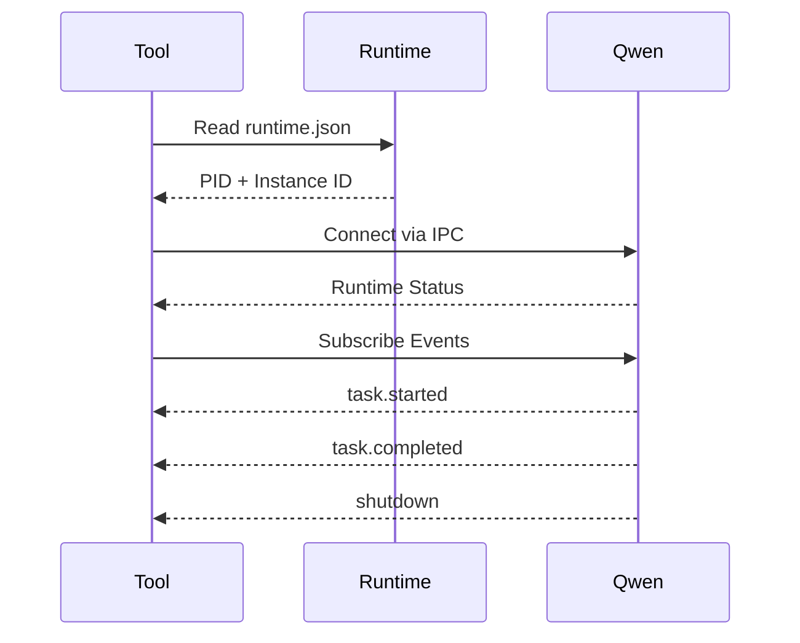

- IPC (Named Pipes / Unix Domain Sockets)

### Phase 4 (Optional)

- Event Streaming API
- Local REST API
- Advanced telemetry

Each phase is independently useful and fully backward compatible.

---

# Conclusion

Qwen Code has already evolved into more than a command-line application. It is becoming a platform for AI-assisted development.

As the ecosystem grows, external tools will increasingly need a reliable way to discover, monitor, and communicate with running Qwen instances.

Providing an official runtime interface—based on a PID file, Runtime JSON, CLI API, and IPC—would replace fragile process-scanning heuristics with a documented, cross-platform solution.

This design follows patterns already established by many successful developer platforms, while remaining lightweight, extensible, and backward compatible.

For these reasons, I believe a standardized runtime interface would be a valuable addition to Qwen Code and would significantly improve the developer experience for both the core project and the wider ecosystem.

Thank you for considering this proposal.


# Industry Precedents

The concepts proposed in this RFC are not new. Similar runtime discovery mechanisms are already used successfully in many widely adopted developer tools and infrastructure projects.

| Project | Runtime Discovery | IPC / API | Status Interface |
|---------|-------------------|-----------|------------------|
| Docker | Unix Socket / Named Pipe | REST API | docker info |
| VS Code | IPC Channels | JSON RPC | Extension API |
| PostgreSQL | PID File | Unix Socket | pg_ctl status |
| Redis | PID File | TCP / Unix Socket | INFO |
| Nginx | PID File | Signals | nginx -t |
| OpenSSH | PID File | Unix Socket | ssh-agent |
| Language Server Protocol | stdio / IPC | JSON-RPC | Official Protocol |

The proposed architecture follows well-established industry patterns rather than introducing a new or proprietary solution.

This reduces implementation risk while making Qwen Code more familiar to developers who already work with modern tooling.

# Non-Goals

This proposal intentionally does **not** attempt to:

- Change how Qwen Code is launched.
- Replace the existing CLI.
- Introduce a mandatory background service.
- Require administrator privileges.
- Expose conversations or prompts.
- Introduce network dependencies.
- Require any changes from existing users.

The proposal only standardizes runtime discovery and communication for tools that explicitly choose to use it.

# Migration Path

Migration can be completed incrementally.

Phase 1

- Create the runtime directory.
- Write the PID file.
- Write runtime.json.

No behavioral changes.

Phase 2

Implement:

```
qwen status
```

and

```
qwen status --json
```

Phase 3

Add IPC support.

Existing tools continue working.

New tools automatically gain access to the runtime interface.

No breaking changes are introduced at any stage.


# Runtime Discovery Flow



# Runtime Architecture

```mermaid
graph TD

A[External Tool]

A --> B[CLI]

A --> C[Runtime JSON]

A --> D[PID File]

A --> E[IPC Socket]

B --> F[Qwen Runtime]

C --> F

D --> F

E --> F
